# Data Acquisition Service App
At this time, we do not have the deployment of the Power App and Power Automate flow automated. We are working on this. 
For now, please follow these steps to deploy and configure the Handshake App for use.
Note: this is a concept to collect, shape and send a set of data consumer/data publisher parameters to a SQL based contol table which is then leveraged by dynamic, metadata driven pipelines in Azure Data Factory to ingest data from multiple source systems. 
This is a parameterized Power App that leverages multiple micro services to get and send data to several SQL tables allowing the app to be configured without having to know Power Apps. 
Functionality is basic, and no error proofing or required field checks are present at this time. 

1. Download the zip file from the repo 

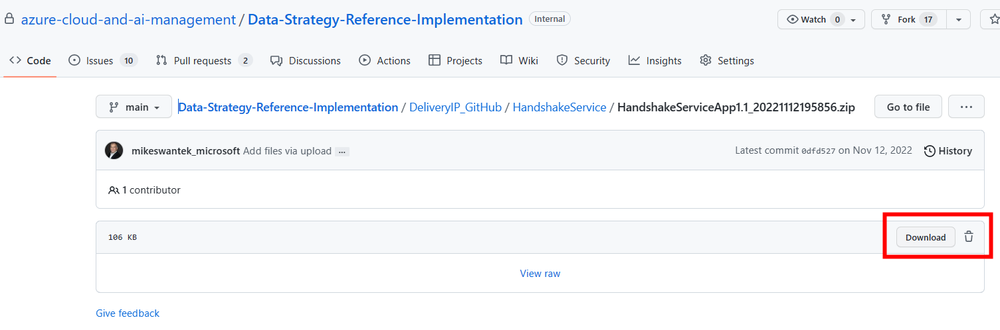

2. Open the Power App environment. This would be set up and supplied by the customer. We do not deploy the Power Platform via code at this time. 
3. Add the following connection to the environment:
- Microsoft 365 users connection - authenticate as admin of power platform (service account)
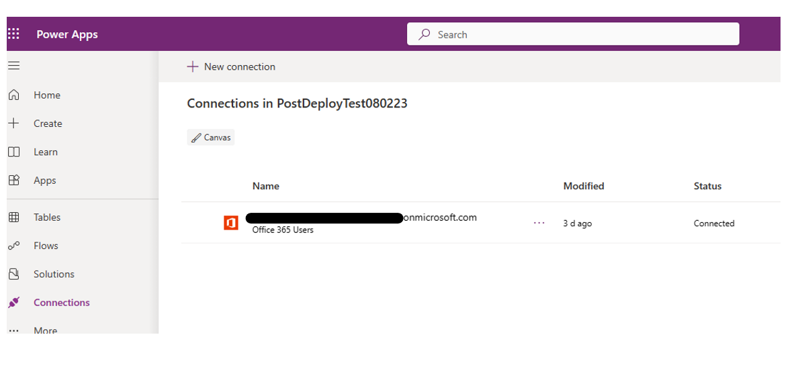

4. Select the Apps tab in the left navigation and then Import Canvas App that you downloaded locally,using the button in the header.
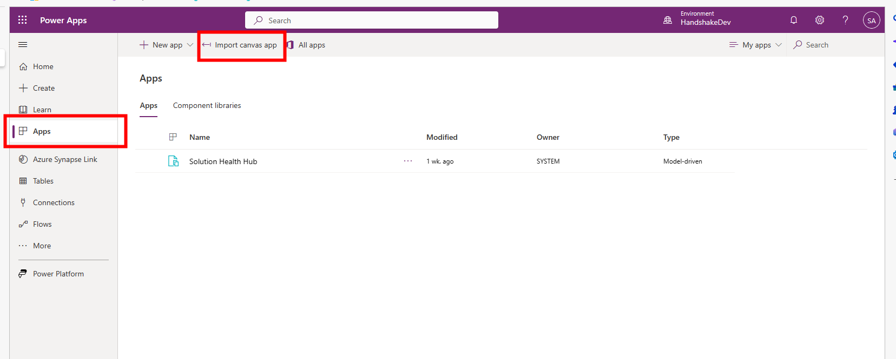

5. Select the upload button and navigate to the location of the package file from the GitHub repo.
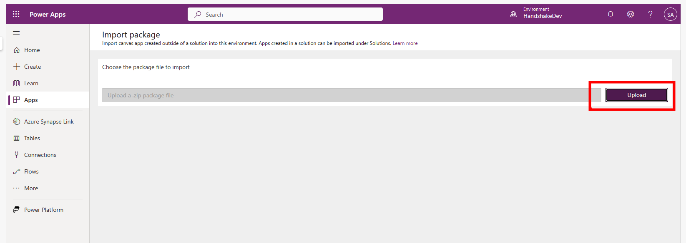

6. On this screen, you can rename the app before it is added to the environment. Select the ‘wrench’ icon to change settings. 
**Note that the flows needed to communicate with the Logic Apps are deployed with the app.**
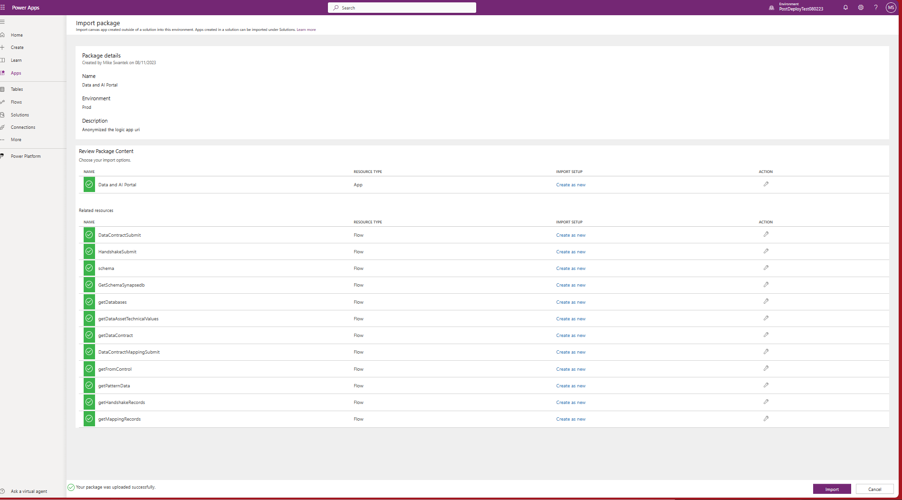

7. The next step it so enable the flows. Navigate to the Flows section and notice that the flow is greyed out. This is because it is deployed in a disabled state. We must enable it for the solution to work. 
Click the triple dots and select ‘Turn on’
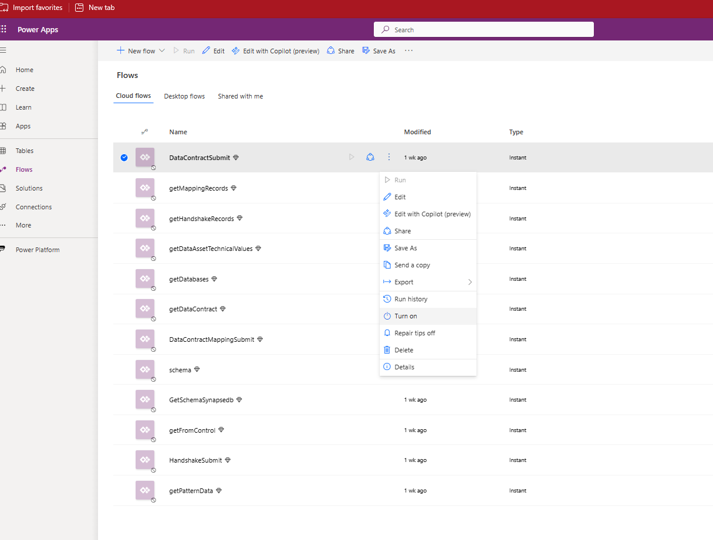

8. Now we will get the uri address that from the Logic App. We must get the endpoint address of the Logic App and copy it first.
 -  Navigate to the Logic App resource group in the subscription.
 -  Open the DataContractIngestion Logic app.
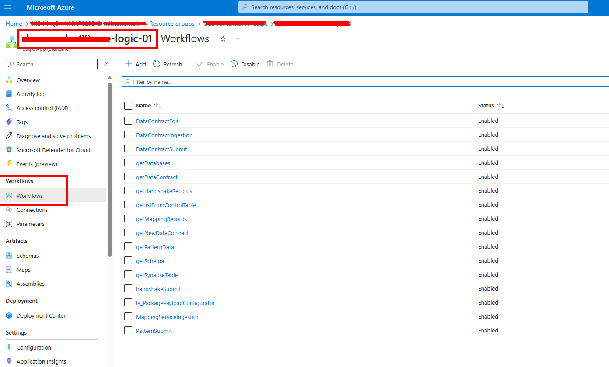

9. Edit the Logic App in Designer mode
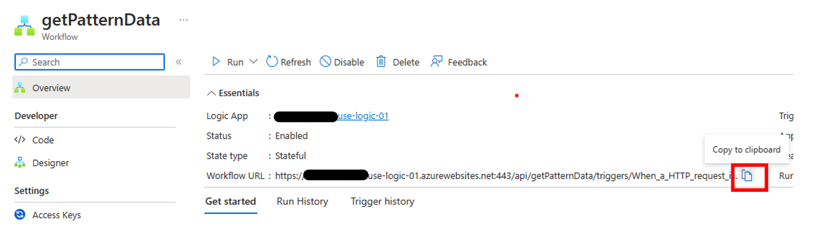

10. Now we will edit the uri address that points to the Logic App. Start by editing the flow. You will need to navigate back to the Power Apps environment.
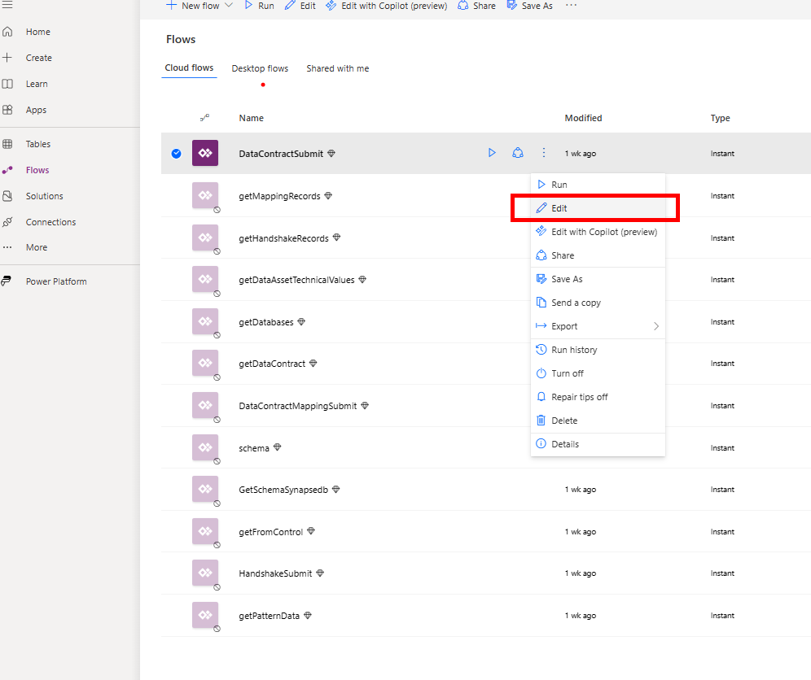

111. Select the HTTP connector and paste on the value copied from the Logic App in step 11
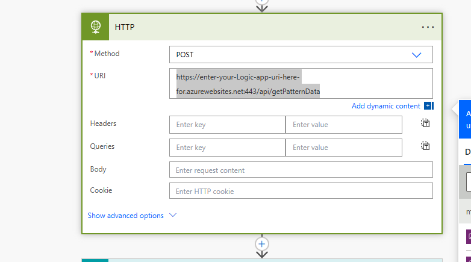

12. Save the Power Automate Flow
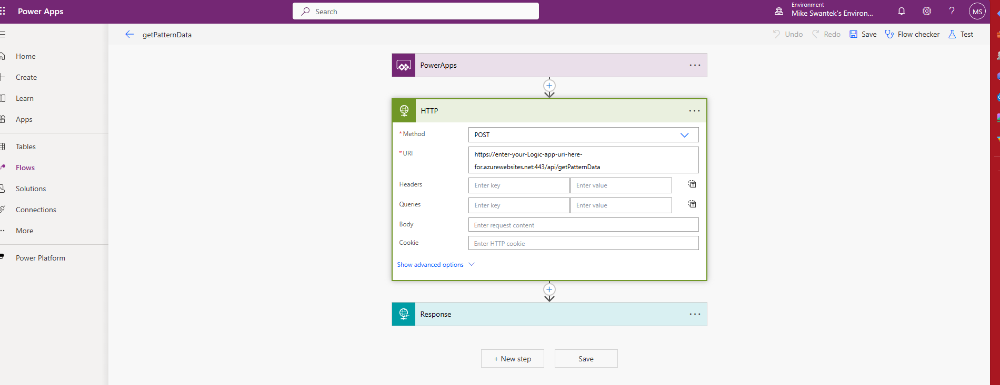

13. Repeat this process for each of the logic apps/flows

| Flowname | LogicApp called | SP it calls |
| --- | --- | --- |
| getMappingRecords | getMappingRecords | queries the mapping table |
| getPatternData    | getPatternData    | queries the pattern table |
| DataContractMappingSubmit | MappingServiceIngestion | InsertDataMapping |
| getDataContract | getDataContract | queries the DataContract table |
| GetSchemaSynapsedb | getSynapseTable | queries the information_schema.columns query  |
| schema | getSchema | dbo.schemaDynamic (serverless) |
| getHandshakeRecords | getHandshakeRecords | queries the dbo.handshake table  |
| getFromControl | getlistFromControlTable | Queries the IngestedLandingDataAudit |
| HandshakeSubmit | handshakeSubmit | usp_InsertHandshake |
| getDatabases | getDatabases | Query: SELECT * FROM sys.databases  |
| DataContractSubmit | DatacontractSubmit | usp_InsertDataContract |
| DataContractEdit | DataContractEdit | usp_EditDataContract |
| getDataAssetTechnicalValues| getNewDataContract |  usp_getDataContractRecordsDynamic |

Now the required connections have been configured for the app and flows.

14. Navigate to the Power App and Edit the app
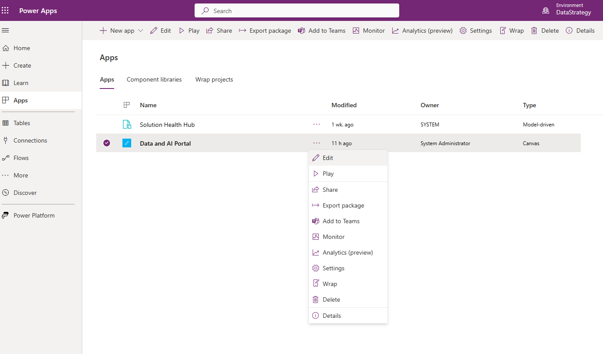

15. The first time this is edited, you will be prompted to connect to the needed connections. The system will install this as the user that is currently logged in, so be sure it is with the service account or admin account so that the connector will work for all users.
Click allow
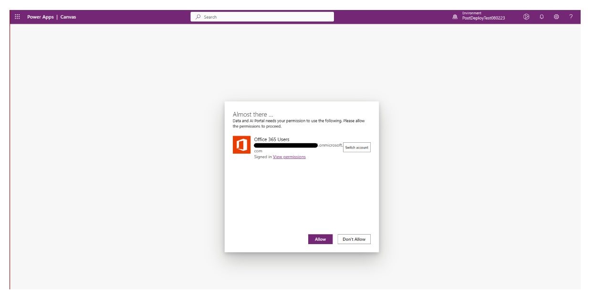

At this point the Handshake Shared Service is configured and will now allow data registration into the control table.

