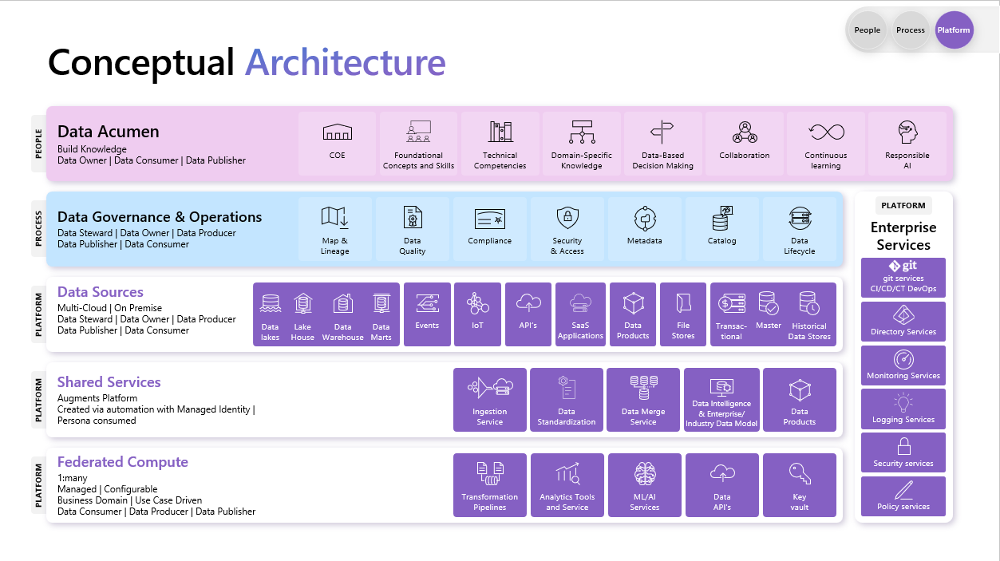
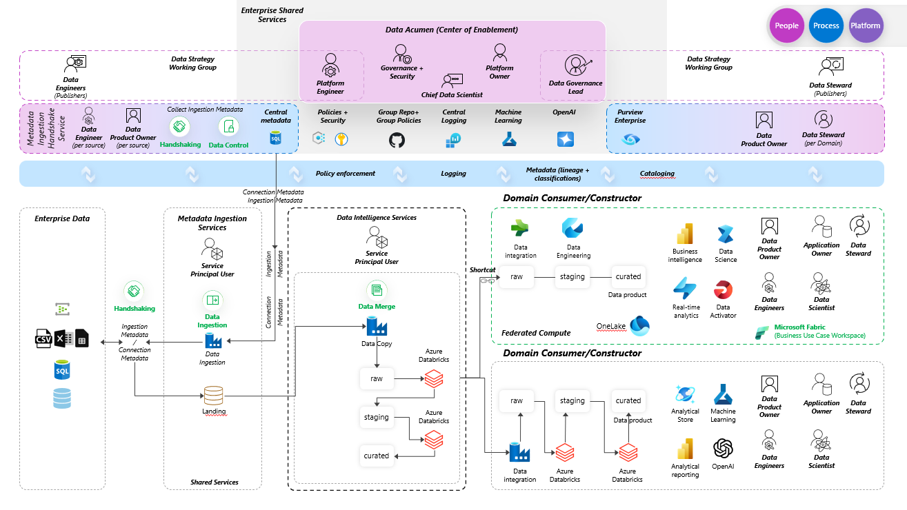

# Introduction
Data Strategy is the foundation for implementing a modern data platform, and leverages Microsoft's own internal data estate journey.

# Steps to Deploy The Data Platform
- [Click Here to Navigate to Deployment Instructions](DeploymentComponents/README.md)

# Data Strategy

Microsoft Data & AI Strategy Platform is an approach to managing data within an organization. It provides the ability to move foundational work to innovation work, maintaining federated consumers’ compute agility while also promoting data engineering reuse, improving data compliance efforts, and controlling data sprawl/cost. With business use case delivery at the core of an effective data strategy, it frees the data out of the application development continuum into the data estate continuum not only for speed to intelligent Business insights but also speed to intelligent business applications. 

A robust data management and governance capability is crucial for leveraging AI technologies and gaining a competitive edge during an AI-driven transformation. This capability spans people, process, and platform (technology). Therefore, an organization's data strategy should reflect this comprehensive approach. An organization's data strategy should: 

- Focus on clearly identified high-impact business and AI use cases. 

- Iteratively enhance data handling across people, process, and platform (the three P’s to success) with a systems thinking approach, focusing on holistic and progressive improvement. 

- Keep in mind that transformation towards an AI and data-driven operation is a long-term process that requires patience, resilience, and sustained focus. 

Data strategy is essential to successfully industrialize AI, bringing together People, Process and Platform to harness data's full potential for innovation and growth, not as a byproduct of, but instead, the driving force for innovation and growth.   

## The Three P's

### People
The People component of our Data Strategy is centered on cultivating a culture where data and AI are more than mere tools—they are at the heart of our organizational identity and operations. This initiative is about valuing data, embracing AI, and committing to ongoing learning and evolution. An intelligence-driven culture integrates data and AI into the core of its operations, treasures data as a precious resource, and advocates for its broad accessibility and active use in decision-making. It also involves the incorporation of AI into various workflows, utilizing AI to streamline repetitive tasks, amplify human capabilities, and derive meaningful insights.

This culture is defined by its focus on a data-centric methodology, which prioritizes the gathering, analysis, and application of data. It ensures that data is not only valued but also easily accessible to everyone within the organization, which is essential for making well-informed decisions. By embedding data-driven insights into the decision-making process, an organization can nurture a culture that is authentically intelligence-driven.
- **Center of Enablement**: provide assistance to help others achieve use case enablement success.
- **Ground your team**: provide foundational data/ai acumen to all members of the organization to assist in understanding the upcoming changes.
- **Assess technical competencies**: understand who posesses these strengths in your enterprise estate.
- **Domain specific SME's**: identify your SME's in the estate.
- **Foster Learning**: allow the team to learn and grow.
- **Lead**: practice what you preach. Lead with data driven decisions. Let others emulate.

### Process
The Process aspect of our Data Strategy should aim for a central governance of data while allowing for federated elements to maintain business and AI agility. The design should strive to eliminate any obstacles in data lifecycle management and facilitate proper data access. Key processes to consider include:
- **Data product registration**: an automated process to register and catalog estate data products.
- **Data Quality**: administer and remediate data quality issues at source or as far left as possible.
- **Data lifecycle management**: overseeing data from its inception to its retirement.
- **Data lineage**: ensuring data traceability and transparency.
- **Data classification, compliance, and ownership**: maintaining data integrity and trustworthiness.
- **Data Access/Security Operations management**: safeguarding data against threats and only allowing in only those that have access.
- **Continuous review and alignment**: making sure data strategies stay relevant and in sync with business objectives.
- **Cost management**: monitoring and controlling the expenses related to data.
- **Centralized Metadata store**: Leveraging metadata across the data estate to automate as much as possible

Together, these processes form the backbone of an intelligence-driven culture where data and AI are woven into the operational fabric of the organization, propelling business outcomes forward.

### Platform
The Platform pillar of a successful Data Strategy should prioritize scalability and the provisioning of shared enterprise services that support self-service automation. This requires a robust technology solution that integrates a data analytics platform with Machine Learning and AI. 

A fundamental quality of this pillar is flexibility, particularly in terms of interoperability with various data sources and connectors. This allows for easy integration with a wide array of data systems, both common and bespoke. It's essential that the platform enables data visualization, discovery, and business intelligence, and is compatible with DevOps and associated automation processes. 

The platform should scale with the growth of the organization and workloads, managing increasing data volumes and complexity without compromising performance, functionality, or security. The platform should enable a federated data product approach to mitigate challenges around resourcing and team capacity.

This particular solution, based in Azure and leveraging Databricks for compute allows for data agnostic ingestion, has a Power App to collect and add the parameters into a control table, and follows a single data landing zone topology but can be leveraged and automated further to create additional domains. 
It also provides a deployment 'feature flag' concept to allow this platform to deploy into a greenfield environment, or to co-exisit with other, pre-existing componentry in the Azure tenant.The platform deployment script in this repo allows ancillary components like Azure OpenAI, Azure AI search, Azure Machine Learning, and many other components to be selected and deployed later, fully integrating into the infrastructure with automated configuration. The ability to create and deploy into a Vnet is also within this code base.

## What are the concepts around a sound, modern data strategy across a data estate? 
This section will explore the main elements of the three essential pillars of Data Strategy: People, Process, and Platform. The goal is to provide some insights on how to develop organizational capacity with Data and AI. These elements are Data Acumen, Data Governance and Operations, Federated Compute, Shared Services, Data Services and Enterprise Services.

### Data Acumen - People
Data acumen is a crucial skill set for any organization aspiring to leverage Artificial Intelligence for business growth and innovation. It is the collective proficiency in understanding and applying data-related concepts and skills, spanning from foundational knowledge to domain-specific insights. 

Developing a robust data acumen within an organization involves multiple facets, each contributing to the overall capacity to harness data effectively. It's not just about understanding the technical aspects of data management; it's about how data can influence business decisions and drive organizational growth. 
 
Building data acumen within an organization requires a strategic and comprehensive approach. Here are some key initiatives to build data acumen: 

- As a way to build Foundational Concepts and Skills ensure team members understand data terminology, structures, and formats. Teach them fundamental statistical concepts and ethical considerations related to data and AI usage.  

- Advance Technical Competencies to equip teams with the tools and skills they need to manipulate and visualize data effectively. This may involve technical training for data extraction, transformation, and loading (ETL) as well as for creating meaningful data visualizations. Familiarize them with cloud platforms for data storage, processing, and analytics. 

- Foster Domain-Specific Knowledge for your industry, its the business processes, and the role data plays in decision making. 

- Promote a culture that values Data-Based Decision Making. Teach team members how to formulate hypotheses, design experiments, and analyse results. 

- Encourage cross-functional communication and collaboration to break down silos and ensure that data insights are shared and acted upon across the organization. 

- Foster Continuous Learning and curiosity about emerging technologies, tools, and best practices. 

- As AI becomes more prevalent, it's important to understand its ethical implications. Embed Responsible AI, considering factors like fairness, transparency, and bias.

### Data Governance and Operations - Process
The way an organization handles the data it uses, in terms of its availability, usability, integrity, and security, is the domain of data governance and operations. This involves setting up standards, policies, and processes to ensure data is managed in a consistent, secure, and compliant way.

A key element of a data strategy that focuses on AI is to adopt a data product mindset. A "data product" is a reliable, reusable data asset that is registered and cataloged. This means defining clear roles such as data product owners (Data Publishers), data owning teams (Data Producers), and data consumers. By treating data as a product, businesses can concentrate on high-value business use cases, package data for easy understanding and use, reduce clutter and compliance and user access risks, control data spread and costs, and maintain trust with stakeholders.

To establish a strong data governance and operations capability, the following key areas need to be covered: 
- **Data mapping** tools provide a visual representation of the data landscape, showing how data flows from source to target systems. **Lineage tools** follow data from its source through transformations, helping identify dependencies and impacts of changes in the data structure. 
- Tools to ensure **Data Quality**: accuracy, completeness, and consistency of data are essential. These provide features like data profiling, cleansing, validation, matching, and monitoring. 
- **Compliance** tools to ensure alignment with legal, contractual, and business rules automate the process of compliance checking and reporting. 
- Tools that enforce **access and security** controls, ensuring data privacy, and protection against data breaches are integral. These may include encryption tools, intrusion detection systems, and identity and access management solutions. 
- Tools to collect, organize, and display data about data (**metadata**) help make data more understandable and usable. 
- A searchable repository (**Data Catalog**) of data assets makes it easier to find and understand data. These tools typically provide metadata, usage information, and data samples. 
- Tools to manage the flow of data through its lifecycle (**Data Lifecycle (DLM)**), from creation and initial storage to obsolescence and deletion. These tools provide features like data classification, retention, archiving, and deletion.

### Data Sources - Platform
Data Sources are the enterprise locations where business and transactional information is stored. These sources, whether they are on-premises or in the cloud, offer different kinds of data , which can be used for Analytics and AI applications. Data Sources can have different formats such as Data Lakes, Data Warehouses, Data Marts, Lake Houses or File Shares, each with different capabilities for data storage and processing. Data sources may also be accessed through REST API (often used for SaaS applications), or through message-oriented sources (such as Message Queues or Publish-Subscribe Systems) for near/real-time data streaming applications. 
Some key Data Source considerations when setting up or updating a data platform to support an AI-driven data strategy are listed below:

1. Data sources should be dependable and provide high-quality and consistent data. 
1. Data sources should be easily integrated into the current or planned data platform architecture. This includes aspects such as API compatibility, connectivity, and data format compatibility. 
1. Data sources should follow all relevant data security and privacy regulations. This includes aspects such as data encryption, access controls, and data anonymization techniques where needed. 
1. Data sources should be able to scale to handle expected load. This requires aspects such as storage capacity, processing power, and network bandwidth. 
1. Especially for AI applications, having real-time or near-real-time data can be important. This requires data sources that offer real-time data streaming capabilities. 
1. The cost of data acquisition, storage, and processing should match the value it brings to the business.

### Shared Services - Platform
In a data platform context, shared services are central data estate services that support the creation, deployment, and management of data and applications. They help organizations to streamline data management processes, reduce redundancies, and enable efficient and effective data use by centralizing common tasks and services based on data best practices and methods. 
The following are the key Shared Services that should be taken into account when creating or updating a data platform:

1. Self-Serve Metadata-Driven Ingestion to allow automatic data ingestion driven by metadata, which reduces manual coding and simplifies data ingestion for data engineers and other users. 
1. Data Standardization to ensure that data is transformed into a consistent format, which makes it easier to comprehend and use across the organization. This may include operations like converting data to common units, standardizing the number of decimal places etc. 
1. Data Merging to integrate data from different sources into a single, consolidated view, which provides a more comprehensive and accurate picture of the data. 
1. Data Intelligence as a way of using AI and machine learning to enhance the data and provide insights. 
Enterprise data models to provide high-level representations of an organization's data, which help to facilitate data management tasks such as data integration, data governance, and data quality. 
1. Published Data Products to provide reusable data assets that are built on top of the data platform, such as dashboards, reports, predictive models, and AI-powered applications.

### Enterprise Services - Platform
Enterprise Services the operations and infrastructure within any organization aiming to leverage data for AI-based innovation and growth. These services include DevOps, a practice that combines development and operations to shorten the system development life cycle and provide continuous delivery with high software quality. CI/CD/CT, or Continuous Integration, Continuous Delivery, and Continuous Testing, which are practices designed to improve and expedite the software delivery process. Identity Services, which ensure secure and efficient user access management across the organization. Operational Monitoring and Logging, to oversee system performance, identify issues, and maintain a comprehensive record of system activities for troubleshooting and analysis. Security Services, to protect sensitive information and systems from cyber threats, ensuring data integrity and availability. Enterprise Services underpin not only the Data Platform, but also other technical platforms within an enterprise, they are fundamentally important for data-driven innovation. 

### Federated Compute - Platform
Federated Compute is a way of performing computation that allows data to stay and be processed where it is, by pointing the compute engine at the data source. This is different from the traditional way of copying data to where it can be computed. We call this the separation of data from compute. This is useful for big data applications like Machine Learning and Analytics, where moving data can be costly and time-consuming. Data APIs make this possible, by acting as links between different data sources and computing nodes, so that data can be accessed, processed, and used across different systems and locations.

To build or modernize a data platform with Federated Compute, there are some key things to think about:

- With Federated Compute, data does not leave its source, which can help with data privacy regulations. But, it's important to make sure that the computation or transformations that happen do not expose private data. There should be security measures to protect the data during computation. 
- Organization needs a strong and consistent network infrastructure to enable fast data communication between different nodes in a federated computing setup. Any network delays or failures can affect the performance of transformation pipelines, analytical tools, and ML/AI services. 
- A clear data governance policy is needed to manage data access, usage, and quality. This is especially important in a federated environment where data is spread across multiple locations. 
- The system should be able to handle increase in data volume, velocity, and variety. 
- The parts of the Federated Compute system should work well together. This includes transformation pipelines, analytical tools, and ML/AI services, which need to be able to get and process data from different sources. 
- The organization needs to have the right skillsets to set up and manage Federated Compute environments. This includes knowledge of distributed computing, data privacy and security, and the specific tools and platforms being used. 
- The choice of tools and platforms for transformation pipelines, analytical services, and ML/AI services is important. These tools should support federated computing, be scalable, and be easy to connect with existing systems. 
- The performance of the Federated Compute system should be monitored and improved regularly.

### Operationalize
In this AI-driven age, organizations must evolve their operational models and embed systems thinking into their culture. They must develop data and AI acumen, becoming custodians of their data to unlock its full business potential. A robust data strategy is essential, transforming data & analytics into a core business discipline, guided by strong leadership and a clear vision for successful transformation. It's not merely about data collection; it's about devising a strategy to maximize the value of data once it's gathered.

As we progress through this transformative period, it's crucial to recognize that data is not just an asset but a strategic necessity in the AI landscape. A well-defined data strategy, focused on enabling business use cases, is key for organizations to become truly data-driven in an AI-centric world. This involves operationalizing the modern data estate through a modern data platform that supports the strategic vision and empowers the organization to harness the power of AI effectively.

## Logical architecture for a modern data platform

## How to leverage this repository effectively
### Start with Business Outcomes and Use Cases
Start with well-defined business problem and then identify the AI use cases that will solution the problem and measure their impact. Use Objectives and Key Results (OKRs) to define the vision, success factors, and stakeholders for each use case. Assess the current and desired data estate and identify the people, process, and platform capabilities needed to enable the use cases. This shows the gaps and opportunities to develop a roadmap for the capability plan that supports the company's strategy.

### Don't start from scratch
Use a data strategy framework (like this [one](Delivery/)) to guide the data capabilities design. Focus on the use case-specific needs rather than generic solutions to avoid scope and cost mismatches. For example, address data quality issues within the use case context rather than broadly.

### Establish a data strategy working group
Create and foster the growth of a **data strategy working group** to coordinate data activities across the organization. This group should include experts, stakeholders, and representatives from relevant business units and teams who work together and have clear responsibilities and outcomes along with SLT accountabilty.

### Leverage your team and help others grow
Instead of a data Center of Excellence (COE), create a center of enablement. Learn from each use case and apply the lessons to the next one. Leverage the data engineering and data stewards you currently have to help teach others and replicate.

### This will take time
A data strategy needs to be a gradual and flexible journey that prioritizes outcomes over perfection, and aligns people, process and platforms to unleash the power of data for innovation and growth.

# Data Strategy Delivery IP
Part of the Data Strategy approach recognizes that the creation of delivery accelerators can assist teams in jumpstarting the installation and configuration of Azure artifacts, but also enabling a consistent approach to be adopted during installation of Microsoft Azure components. This code base acts as an 'accelerator' for deploying and configuring key Azure services that are used to produce the overall reference architecture for the Data Strategy offering. 

# Product Backlog
- [Click Here to Navigate to Product Backlog with Epics, Features, and User Stories](DataStrategyBacklog.xlsx)

# Components
The Data Strategy IP consists of the following components:

| Component | Description |
|--|--|
| Reference Backlog |   Data Strategy Reference Backlog (Epics, Features and User Stories) matching the primary components detailed in the Offering collateral which can be imported into a Customer's Azure DevOps project and enhanced according |
| Automated GitHub Deployment |  Bicep templates, code examples for each of the primary Data Strategy component along with automated configuration during SPN driven deployment |
| Feature Flags  | Configuration file of feature flags that can be enabled / disabled to select additional artifacts to be deployed |
| Full deployment instructions |  This documentation library contains architecture patterns, documentation, and usage scenarios including sample ingestion patterns |

# Please Read
This code is intended to assist with delivery of a foundational platform for data strategy. It is possible that not all components will be relevant to every customer - this will need to be discovered and assessed during the Data & AI Strategy Workshops stage to understand the customer's current technical landscape and assess the maturity of the data estate. Also, the reference backlog may need amending to include customer-specific items in addition to those detailed in the base implementation.
# Known Issues
## Power App for Acquisition Services
Currently the Power app collects basic metadata for the ingestion service. It only provides basic functionality. See the readme file in the Data Acquistions service for manual installation/configuration steps.
## Lack of ability to add multiple file names/sources to Acquisition Service App.
This is a known issue, but no resolution is available due to development resources.
## Ability to extend the Acquisitions Services app
There is a need to extend the tables used to populate the Acquisition App fields and make the entire app metadata driven. Main contract page along with the drop down values should all be shifted to a table as the others.

# Contributing
This project welcomes contributions and suggestions.  Most contributions require you to agree to a
Contributor License Agreement (CLA) declaring that you have the right to, and actually do, grant us
the rights to use your contribution. For details, visit https://cla.opensource.microsoft.com.

When you submit a pull request, a CLA bot will automatically determine whether you need to provide
a CLA and decorate the PR appropriately (e.g., status check, comment). Simply follow the instructions
provided by the bot. You will only need to do this once across all repos using our CLA.

This project has adopted the [Microsoft Open Source Code of Conduct](https://opensource.microsoft.com/codeofconduct/).
For more information see the [Code of Conduct FAQ](https://opensource.microsoft.com/codeofconduct/faq/) or
contact [opencode@microsoft.com](mailto:opencode@microsoft.com) with any additional questions or comments.

## Trademarks

This project may contain trademarks or logos for projects, products, or services. Authorized use of Microsoft 
trademarks or logos is subject to and must follow 
[Microsoft's Trademark & Brand Guidelines](https://www.microsoft.com/en-us/legal/intellectualproperty/trademarks/usage/general).
Use of Microsoft trademarks or logos in modified versions of this project must not cause confusion or imply Microsoft sponsorship.
Any use of third-party trademarks or logos are subject to those third-party's policies.
